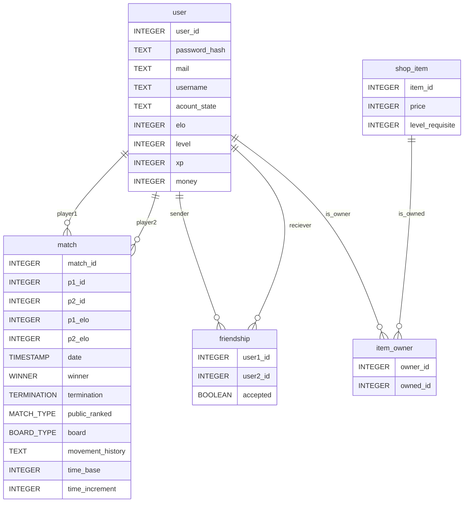

# Laser Chess - Backend [](https://github.com/UNIZAR-30226-2026-01/laser_chess_backend/actions/workflows/ci.yaml)

Backend del juego de mesa online Laser Chess.

## Diseño preliminar de la base de datos


---
```mermaid

classDiagram
    class board_type {
        <<enumeration>>
        ACE
        CURIOSITY
		GRAIL
		SOPHIE
        MERCURY
    }

	class winner {
        <<enumeration>>
		P1_WINS
		P2_WINS
		DRAW
		NONE
    }

	class match_type {
        <<enumeration>>
		RANKED
		FRIENDLY
		PRIVATE
		BOTS
    }

	class termination {
        <<enumeration>>
		TIME
		SURRENDER
		LASER
		UNFINISHED
    }
	